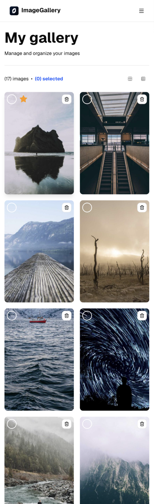
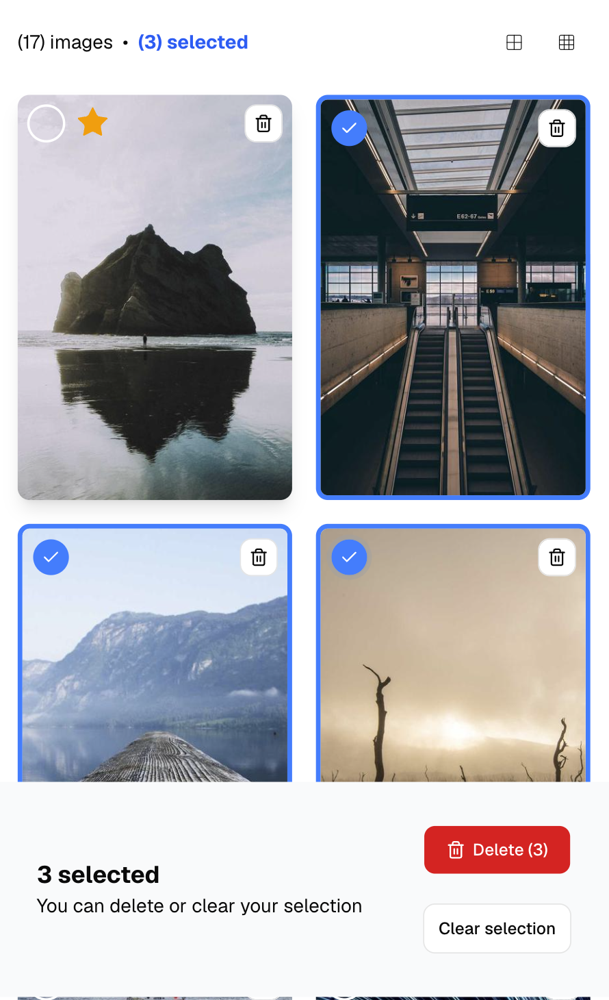
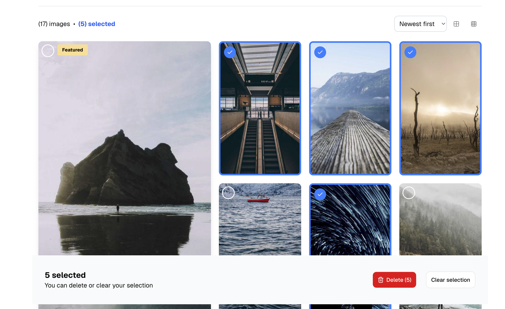

<div align="center">


### Image Gallery · Sprint 4 · IT Academy Barcelona

Explore, manage and organize your images with drag & drop, batch deletion and advanced filtering.

[🚀 Live Demo](https://images-gallery-it.netlify.app/)


</div>

---

## Preview

### 📱 Mobile

| Full page                                    | Selection bar                                            |
| -------------------------------------------- | -------------------------------------------------------- |
|  |  |

### 🖥️ Desktop

| Full page                                   | Selection bar                                           |
| ------------------------------------------- | ------------------------------------------------------- |
|  |  |

---

## Core features

### Gallery management

- Browse images in a responsive grid layout
- Mark images as featured (first position highlight)
- Drag & drop to reorder images
- Real-time image counter

### Image operations

- Delete individual images with confirmation
- Batch delete multiple selected images
- Toggle selection with checkboxes
- Clear selection with one click
- Responsive delete buttons (mobile + desktop)

### User experience

- Sticky selection bar (bottom) with action buttons
- Featured badge on first image
- Responsive design (mobile first)
- Smooth transitions and hover effects

---

## Tech stack

| Category        | Technology                                            |
| --------------- | ----------------------------------------------------- |
| Framework       | [React 18](https://react.dev/)                        |
| Language        | [TypeScript](https://www.typescriptlang.org/)         |
| Bundler         | [Vite](https://vitejs.dev/)                           |
| Styles          | [Tailwind CSS v4](https://tailwindcss.com/)           |
| Drag & Drop     | [@dnd-kit](https://docs.dndkit.com/)                  |
| UI Components   | [shadcn/ui](https://ui.shadcn.com/)                   |
| Testing         | [Vitest](https://vitest.dev/) + React Testing Library |
| Version Control | Git + GitHub (Git Flow)                               |

---

## Getting started

### Prerequisites

- Node.js >= 18
- npm >= 9

### Installation

```bash
# 1. Clone the repository
git clone https://github.com/gemmaadev/it-sprint4-images-gallery.git

# 2. Navigate to the project directory
cd it-sprint4-images-gallery

# 3. Install dependencies
npm install

# 4. Start the development server
npm run dev
```

The app will be available at the URL shown in your terminal after running `npm run dev`

---

## Testing

```bash
# Run all tests
npm run test

# Run tests with UI
npm run test:ui

# Generate coverage report
npm run test:coverage
```

### Test coverage

- **ImageItem Component:** 5 unit tests (100% coverage)
- **Gallery Component:** 7 integration tests (50% coverage)
- **Overall coverage:** 63%

_Note: Drag & drop testing excluded (requires complex dnd-kit setup). Manual testing confirms functionality works correctly._

---

## Project structure

```
it-sprint4-images-gallery/
├── public/
│   └── images-gallery-icon.png
├── src/
│   ├── assets/                     # Static images & icons
│   ├── components/
│   │   ├── ui/
│   │   │   ├── button.tsx
│   │   │   └── button.variants.ts
│   │   ├── Gallery.tsx
│   │   ├── Gallery.test.tsx
│   │   ├── GalleryHeader.tsx
│   │   ├── GalleryToolbar.tsx
│   │   ├── ImageItem.tsx
│   │   ├── ImageItem.test.tsx
│   │   ├── PageHeader.tsx
│   │   └── SelectionBar.tsx
│   ├── data/
│   │   └── images.ts               # Mock image data (17 items)
│   ├── hooks/
│   │   └── index.ts
│   ├── styles/
│   │   ├── index.css
│   │   └── variables.css
│   ├── types/
│   │   ├── image.ts
│   │   └── index.ts
│   ├── utils/
│   │   ├── cn.ts
│   │   └── index.ts
│   ├── App.tsx
│   ├── main.tsx
│   └── setupTests.ts               # Vitest setup
├── vite.config.ts
├── package.json
└── README.md
```

---

## Author

**Gemma Maeso** · [@gemmaadev](https://github.com/gemmaadev)

Project developed as part of the **IT Academy** program by Barcelona Activa · Sprint 4
